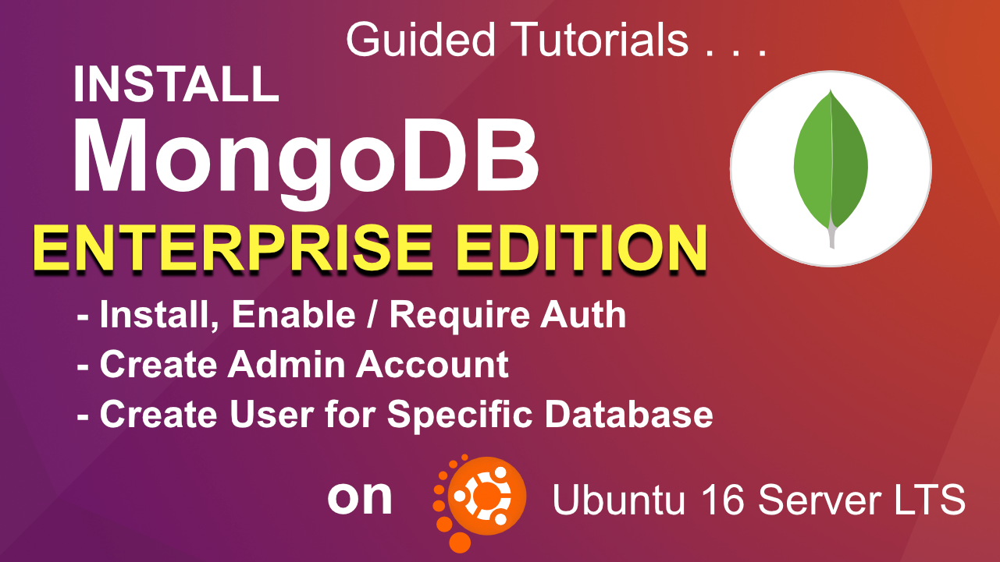

# Install MongoDB 3.4 Enterprise Edition on an Ubuntu 16 Server LTS 



### Overview
1. Install MongoDB Enterprise
2. Create an Admin User with the privileges to manage users and roles.
3. Enable and Require Authentication for Accessing MongoDB
4. Create a New Database and Assign a New User to the Data with Read and Write Privileges.
5. Test Video Database Connection.

---
## Install MongoDB 3.4 Enterprise

[MongoDB Official Docs](https://docs.mongodb.com/v3.4/tutorial/install-mongodb-enterprise-on-ubuntu/)

_Copy and Paste the following commands..._

1. Import the public key used by the package management system
```bash
sudo apt-key adv --keyserver hkp://keyserver.ubuntu.com:80 --recv 0C49F3730359A14518585931BC711F9BA15703C6
```
2. Create a /etc/apt/sources.list.d/mongodb-enterprise.list file for MongoDB. (Ubuntu 16)
```bash
echo "deb [ arch=amd64,arm64,ppc64el,s390x ] http://repo.mongodb.com/apt/ubuntu xenial/mongodb-enterprise/3.4 multiverse" | sudo tee /etc/apt/sources.list.d/mongodb-enterprise.list
```
3. Reload local package database.
```bash
sudo apt-get update
```
4. Install the MongoDB Enterprise packages<br />
_Install the latest stable version of MongoDB Enterprise_
```bash
sudo apt-get install -y mongodb-enterprise
```
---
## Start MongoDB Server and Create a Symlink

_Type the commands..._

1. Start the service
```bash
sudo systemctl start mongod
```
2. Check the service status
```bash
sudo systemctl status mongod
```
3. Create Symlink and Auto-restart server when server reboots.
```bash
sudo systemctl enable mongod
```
4. Restart service
```bash
sudo service mongod restart
```
---
## Create an Admin User with the privileges to manage users and roles.

[Authentication Official Docs](https://docs.mongodb.com/manual/tutorial/enable-authentication/)

1. Type:
```bash
mongo
```
2. In the **mongo shell** type and press Enter.
```shell
use admin;
```
3. Create new Admin User by typing...
```bash
db.createUser(
 {
   user: "AdminDev",
   pwd: "AdminDev1",
   roles: [{ role: "userAdminAnyDatabase", db: "admin" }]
 }
);
```
4. Type and press Enter:
```bash
exit 
```

5.  Type and press Enter:
```bash
clear
```

---
## Enable and Require Authentication for Accessing MongoDB

1. Type and press Enter:
```bash
sudo vim /etc/mongod.conf
```
2. Scroll-down until you find **#security**
3. Move your cursor below the **#security** comment.
4. Press the **" i "** key on your keyboard to enable editing mode / insert mode.
5. Type:
```bash
security:
  authorization: "enabled"
```
6. Press the **"esc"** key on your keyboard. (Escape key)
7. Type and press Enter: (include the colon)
```bash
:wq
```
_...this means **write** and **quit**._

8. Type and press Enter:
```bash
sudo systemctl restart mongod
```
9. Type and press Enter:
```bash
sudo systemctl status mongod
```

---
## Create a New Database and Assign a New User to the Data with Read and Write Privileges.

1. Log into mongo with Admin user
```bash
mongo --port 27017 -u "AdminDev" -p "AdminDev1" --authenticationDatabase "admin"
```

2. Type and press Enter: <br />
_...if database does not exist it will create it!_
```bash
use video;
```

3. Type and press Enter:
```bash
db.createUser(
 {
   user: "nodeUser",
   pwd: "nodeUser1",
   roles: [{ role: "readWrite", db: "video" }]
  }
);
```

4. Type and press Enter:
```bash
exit
```
---
## Test Video Database Connection

1. Log in a user and _change "admin" to "video"_
```bash
mongo --port 27017 -u "nodeUser" -p "nodeUser1" --authenticationDatabase "video"
```

2. Type and press Enter:
```bash
use video;
```

3. Type and press Enter:
```json
db.movies.insertOne({ "title": "Jaws", "year": 1975, "imdb": "tt0073195" });
```
4. Type and press Enter:
```bash
db.movies.find().pretty();
```
---
### Finished !!!
